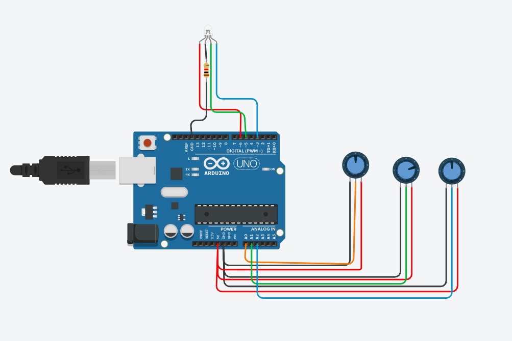

# arduino-rgb-mixer
# Arduino RGB LED Color Mixer 🎨

My first GitHub project! This repository contains an interactive circuit built with an Arduino Uno that uses three potentiometers to manually control the red, green, and blue channels of an RGB LED.

## ⚙️ How It Works
The Arduino reads analog values (0 - 1023) from three separate potentiometers. Using the `map()` function in C++, these values are converted into Pulse Width Modulation (PWM) signals (0 - 255). These PWM signals are then sent to the RGB LED, allowing for real-time color mixing. The current RGB values are also printed to the Serial Monitor.

## 🛠️ Components Used
* 1x Arduino Uno R3
* 1x RGB LED (Common Cathode)
* 3x 10kΩ Potentiometers
* 1x Resistor 
* Jumper Wires 

## 💻 The Code
The core logic relies on `analogRead()` for the inputs and `analogWrite()` for the outputs. Check out the `arduino_rgb_mixer1.ino` file to see the full C++ script!

## 📸 Circuit Diagram

